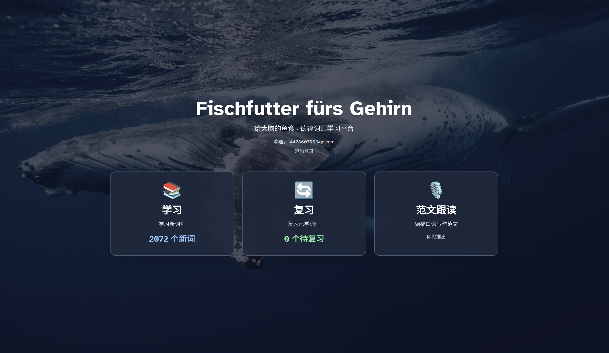
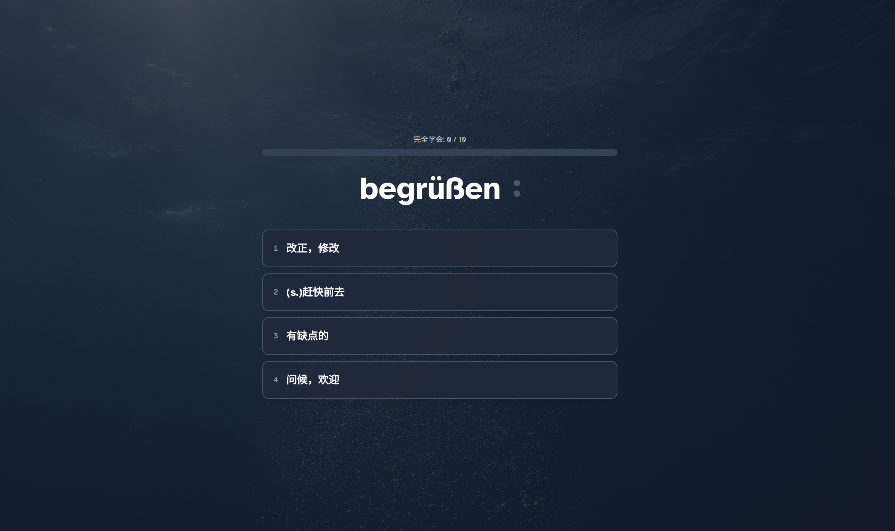
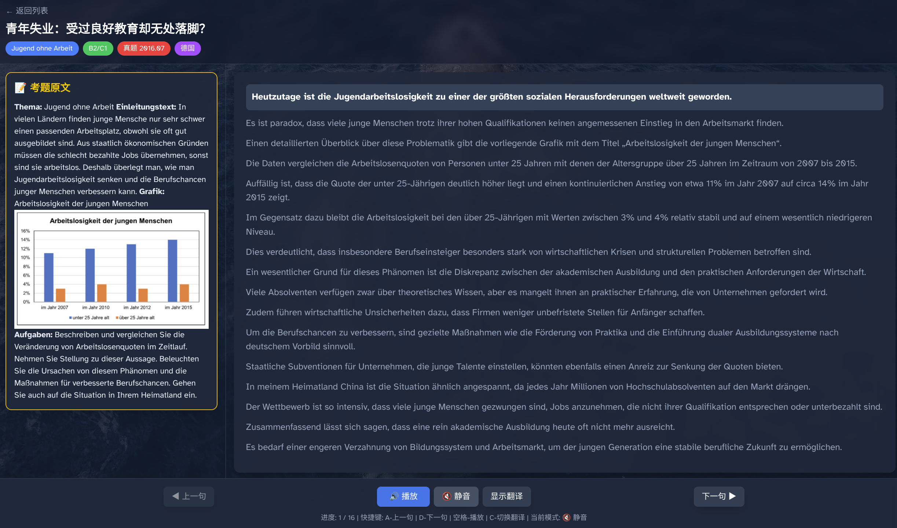
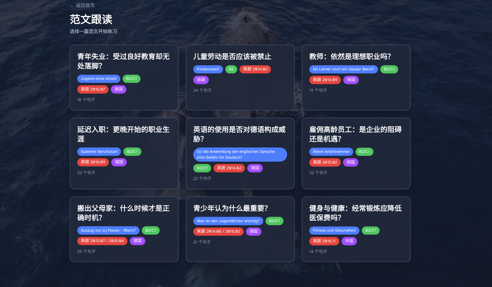

# TFMaster - 给大脑的鱼食 🐟

**Fischfutter fürs Gehirn** - 专为番茄德福考试打造的智能词汇鱼食平台

---

## 📖 关于 TFMaster

TFMaster 是一款专注于德语学习的智能词汇平台，采用科学的间隔重复算法（SRS），帮助你高效记忆德语单词。无论你是准备德福考试，还是想提升德语词汇量，TFMaster 都能为你提供个性化的学习体验。

### ✨ 核心特色

- 📚 **2072 个德语专四词汇** - 完整覆盖德福考试核心词汇
- 🧠 **智能复习系统** - 基于艾宾浩斯遗忘曲线，科学安排复习时间
- 🎯 **完全学会机制** - 连续两次答对才算真正掌握
- 🔊 **德语发音** - 点击单词即可播放标准德语发音
- 📝 **范文跟读** - 德福口语写作范文逐句练习
- 🎨 **精美界面** - 沉浸式学习体验，专注于学习本身

---

## 🚀 快速开始

### 首页

首页提供三大核心功能入口：

1. **📚 学习** - 学习新词汇，每天 10 个新单词
2. **🔄 复习** - 复习已学词汇，巩固记忆
3. **🎙️ 范文跟读** - 德福口语写作范文练习

---

### 📚 学习与复习

#### 学习新词汇

- 每天学习 10 个新单词
- 点击德语单词即可播放标准发音
- 按空格键快速播放发音
- 四选一的选择题模式，降低学习难度
- 答错后会显示详细释义和例句，帮助理解

#### 智能复习系统

- 基于艾宾浩斯遗忘曲线的间隔重复算法
- 系统自动安排最佳复习时间
- **完全学会机制**：连续两次答对才算真正掌握
- 进度条实时显示已完全掌握的单词数量

---

### 🎙️ 范文跟读

#### 范文库

- 精选德福口语和写作范文
- 涵盖常见话题和场景
- 每篇范文都经过精心挑选和校对

#### 逐句练习

- 范文按句子拆分，逐句练习
- 点击句子播放德语发音
- 可以重复播放，直到掌握为止
- 适合提高口语表达和写作能力

---

## 🛠️ 技术栈

- **前端框架**: Next.js 15 + React 19
- **样式**: Tailwind CSS
- **字体**: Atkinson Hyperlegible（专为可读性优化）
- **后端**: Supabase
- **算法**: SM-2 间隔重复算法

---

## 🎨 个性化配置

你可以通过修改 `src/config/backgrounds.ts` 文件来自定义：

- 各个页面的背景图片
- 遮罩层透明度
- 字体选择

---

## 📝 开始使用

1. 访问首页，选择"学习"开始学习新单词
2. 每天坚持学习 10 个新单词
3. 定期点击"复习"巩固已学词汇
4. 使用"范文跟读"提高口语和写作能力

---

